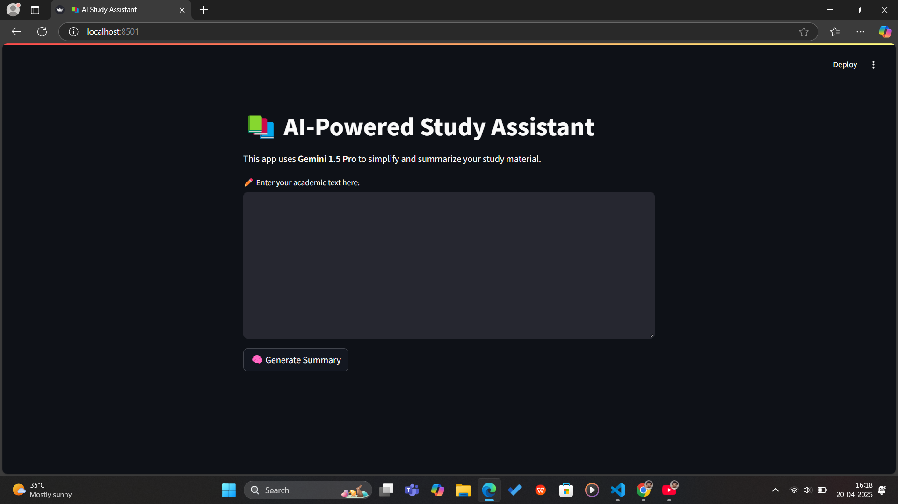
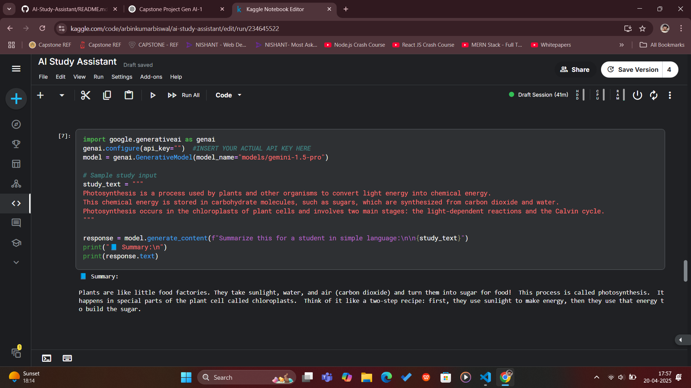
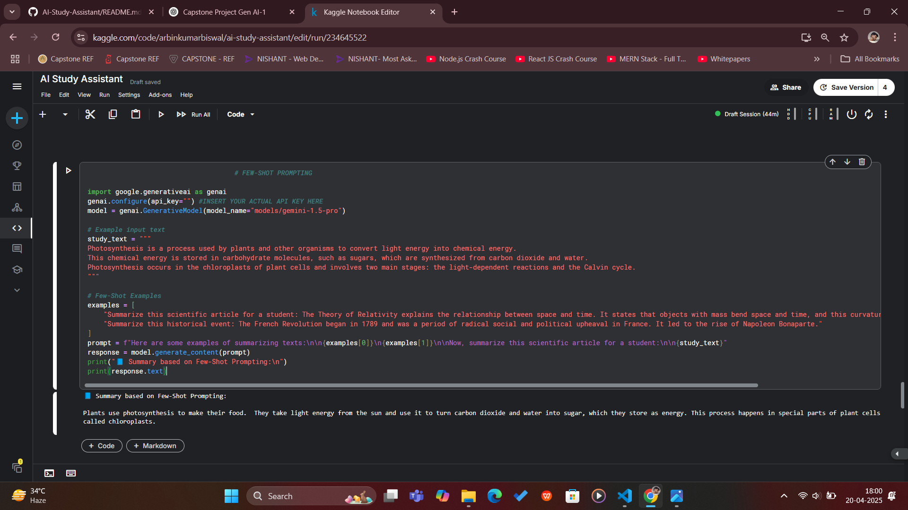
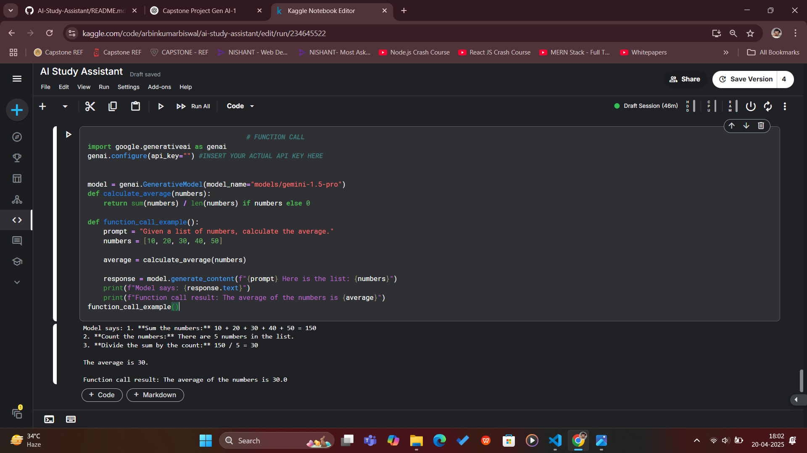

# AI-Powered Study Assistant using Gemini API 🚀

## 1. Project Description 📘

This project is an AI-powered Study Assistant that uses Generative AI models from Google to simplify and summarize complex educational content. While many models are available, we preferred **Gemini 1.5 Pro** for its balanced performance in understanding and generating content.

### ✨ Features:
- Summarizes complex study material into student-friendly language.
- Learns from examples to improve response style (few-shot prompting).
- Performs mathematical operations via tool/function calling.

---

## 2. Problem Statement / Use Case ❓
Students often struggle to understand long, complex academic content and require simplified summaries to grasp the core concepts. This project provides a **solution** to that challenge by making complex information easier to digest.

💡 **How does this project solve the problem?**  
- **Simplified Summaries**: The assistant allows users to input academic text and get clear, simplified summaries that focus on the key ideas.
- **Tutor-like Responses**: By learning from examples, the AI can simulate a tutor and answer questions or explain concepts in an easy-to-understand way.
- **Mathematical Operations**: The model can perform basic calculations, helping students understand problems that require mathematical reasoning.

The assistant acts like a **personal AI tutor**, enhancing self-study, revision, and content understanding for students.

---

### ✨ Features of the Assistant

- 📚 Simplifies long and complex study material into student-friendly summaries.
- 🧠 Learns from user-given examples to enhance its responses (few-shot prompting).
- ➗ Performs basic mathematical operations through AI-powered function calling.
- 🔁 Provides consistent and structured responses using templates/prompts.
- 📌 Works seamlessly with Python.

---

## 3. Gen AI Used 🔍

- **Document Understanding** – Summarized and simplified study content.
- **Few-Shot Prompting** – Used examples to guide the model’s output.
- **Function Calling** – Model performed tasks like calculating averages.

🔹 Model: **Gemini 1.5 Pro** – for better reasoning and token handling.

---

### 🧪 Gen AI Capabilities Demonstration

Below are real examples showing how the assistant leverages different Gen AI techniques:

---

#### 1️⃣ Document Understanding - Summarization

This shows how the assistant summarizes complex academic content into simple, student-friendly language.

---

#### 2️⃣ Few-Shot Prompting - Learning from Examples

By providing a few examples, the assistant learns the expected style and format for responses.

---

#### 3️⃣ Function Calling - Performing Tasks like Calculations

The assistant can perform calculations by calling simple functions, making it smarter than just a chatbot.

---

## 4. Solution Architecture ⚙️

- User inputs academic content via notebook or Streamlit interface.
- The content is sent to Gemini 1.5 Pro using the Google Generative AI API.
- The model processes the prompt and returns a simplified summary.
- Output is then displayed to the user.
- API keys are securely managed using environment variables.

---

## 5. Tech Stack 💻

- **Language**: Python
- **Model**: Gemini 1.5 Pro
- **Environment**: Kaggle Notebook
- **Deployment**: Streamlit
- **Library**: google-generativeai

---

💡 Limitations:
- API has daily usage limits depending on your key's quota.
- Output quality depends on the clarity and quality of prompts.
- Exposing the API key publicly is a major security risk.
- Requires internet connection and API access for each run.

---

## 7. Conclusion ✅

This project showcases how Generative AI can efficiently summarize content, follow examples, and automate tasks using simple API calls. By utilizing models like **Gemini 1.5 Pro**, we demonstrated scalable, real-world applications with secure API handling. The solution is adaptable for various use cases, providing a strong foundation for future AI-driven automation.
